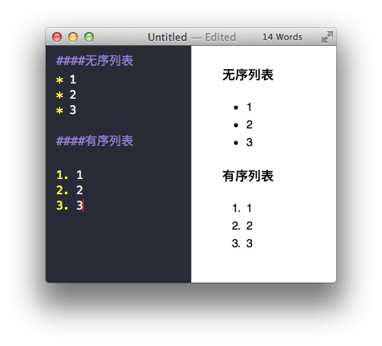

# 入门

如果你是想了解springboot。这里我们对打了关于“是什么”，“怎么做”和”为什么"的问题。安装

## springboot简介
springboot使得创建独立运行、生产级的基于spring的应用
1. 斯蒂芬
2. 斯蒂芬

- 斯蒂芬
> sdf sdfwoe
sdf ,wow斯蒂芬是的，是的分开了第三方， 可是对方，斯蒂芬看看卡萨丁，倒水，可是对方，倒水，发斯蒂芬看看卡萨丁，的，发，卡萨丁，发，斯蒂芬， 

***

